# Smart Farm IoT Monitoring - Trabajo a realizar

## 1. Descripción del proyecto

Este proyecto implementa un **sistema de monitoreo IoT para una granja inteligente** que consume datos de sensores en tiempo real, los valida, enriquece y agrega utilizando **Apache Spark Structured Streaming**, **Apache Kafka** y **Delta Lake**.

### 1.1 Tecnologías principales

| Tecnología | Versión | Rol |
|---|---|---|
| **Scala** | 2.13.18 | Lenguaje principal |
| **Apache Spark** | 4.1.1 | Motor de procesamiento de streams |
| **Apache Kafka** | Confluent 8.0.4 | Message broker (3 brokers KRaft) |
| **Delta Lake** | 4.1.0 | Almacenamiento ACID |
| **Cats** | 2.13.0 | Programación funcional (validaciones) |
| **TypeSafe Config** | 1.4.6 | Configuración externalizada |
| **ScalaTest** | 3.2.19 | Testing |

### 1.2 Tipos de sensores

El sistema recibe datos de **3 tipos de sensores** distribuidos en **3 zonas** de la granja:

| Sensor | Topic Kafka | Campos CSV | Ejemplo |
|---|---|---|---|
| Temperatura y Humedad | `temperature_humidity` | `sensorId,temperature,humidity,timestamp` | `sensor1,23.5,45.2,2023-10-05 14:00:00` |
| Nivel de CO2 | `co2` | `sensorId,co2Level,timestamp` | `sensor1,412.3,2023-10-05 14:00:00` |
| Humedad del Suelo | `soil_moisture` | `sensorId,soilMoisture,timestamp` | `sensor1,67.8,2023-10-05 14:00:00` |

### 1.3 Distribución de sensores por zona

```
Zona 1: sensor1, sensor2, sensor3
Zona 2: sensor4, sensor5, sensor6
Zona 3: sensor7, sensor8, sensor9
```

Cualquier sensor no mapeado (ej: `sensor-chungo-3`) se clasifica como `"unknown"`.

---

## 2. Arquitectura General

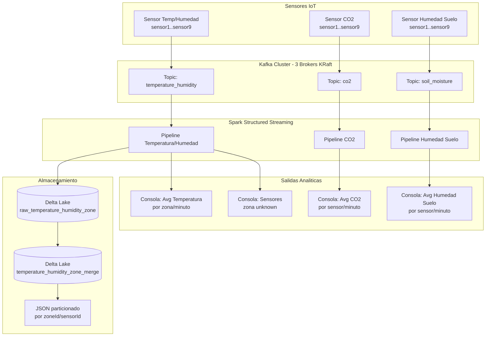

---

## 3. Pipeline de procesamiento detallado

### 3.1 Pipeline de temperatura y humedad (el más completo)

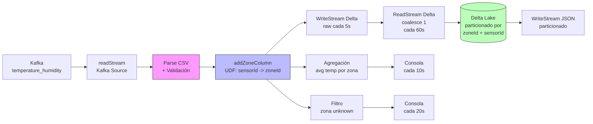

### 3.2 Pipeline de CO2 y Humedad del Suelo (simplificados)

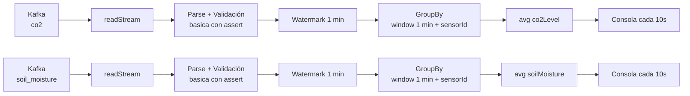

---

## 4. Estructura del Codigo Fuente

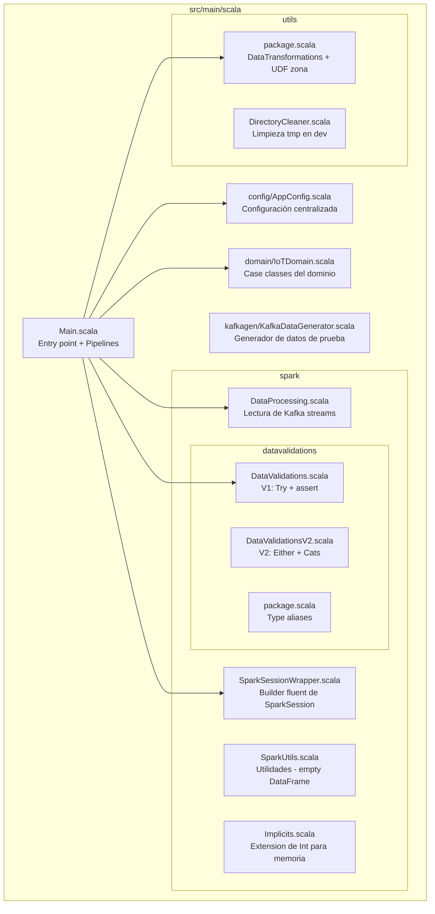

---

## 5. Flujo de Validaciones

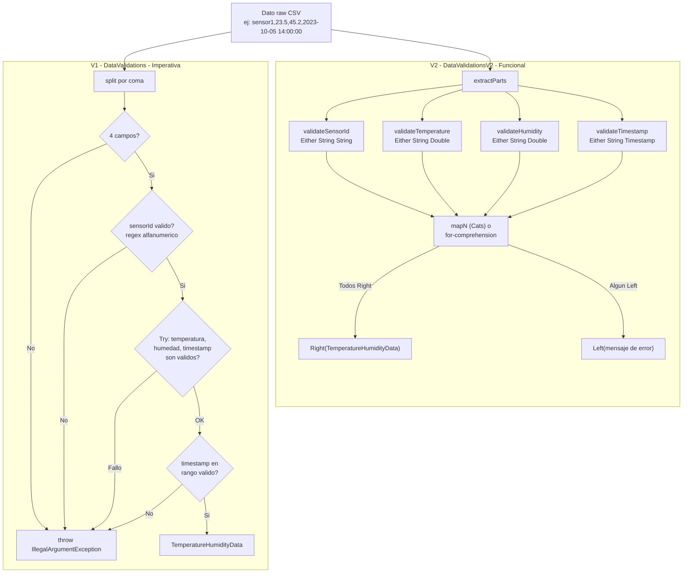

---

## 6. Infraestructura Kafka

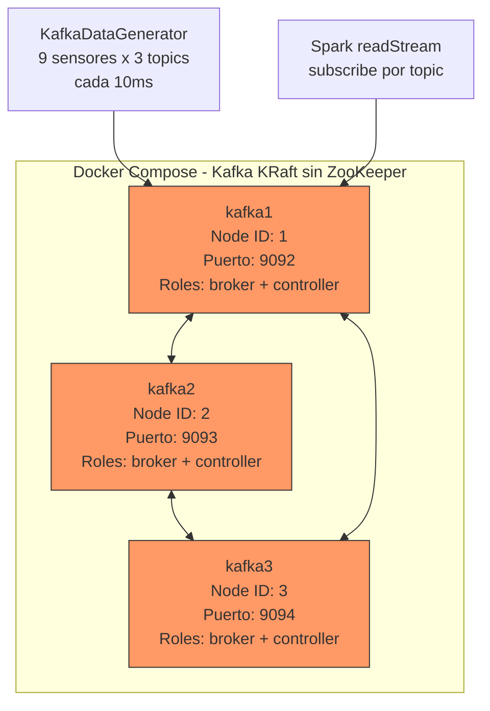

---

## 7. Trabajo a Entregar (10-20 horas)

> **Contexto:** Disponeis de **10 dias** para completar este trabajo, compatibilizandolo con vuestro trabajo.
> Las tareas estan dimensionadas para un total de **10-20 horas** de dedicación.
> Al final del documento se incluyen mejoras adicionales para quien quiera ir más alla.

### Estimación de tiempo por tarea

```mermaid
gantt
    title Plan de Trabajo - 10 dias (10-20h)
    dateFormat  X
    axisFormat %s h

    section Obligatorio
    T1 - Validaciones CO2/Soil V1          :t1, 0, 3
    T2 - Validaciones CO2/Soil V2 + Cats   :t2, 3, 7
    T3 - Eliminar rutas hardcodeadas       :t3, 7, 8
    T4 - Asignar zona a CO2                :t4, 8, 10
    T5 - Persistir CO2/Soil en Delta Lake  :t5, 10, 14
    T6 - Analitica: min/max/count          :t6, 14, 17

    section Bonus
    Bonus - Elegir 1 mejora extra          :b1, 17, 20
```

---

### T1: Completar validaciones de CO2 y Humedad del Suelo (V1) ~3h

**Archivo:** `src/main/scala/spark/datavalidations/DataValidations.scala`

Actualmente `validarDatosSensorCO2` y `validarDatosSensorTemperatureHumiditySoilMoisture` usan `assert` provisional, lo que hace que **la aplicación se caiga** si recibe un dato mal formateado. Se pide:

- Implementar validaciones completas siguiendo el patron de `validarDatosSensorTemperatureHumidity`
- Validar numero de campos (3 para ambos)
- Validar sensorId con regex
- Validar que co2Level / soilMoisture sean Double validos
- Validar timestamp en rango correcto
- Lanzar excepciones descriptivas en caso de error
- Escribir tests unitarios para los nuevos metodos

**Pista:** Ya teneis un ejemplo completo en `validarDatosSensorTemperatureHumidity` (mismo archivo) y tests de referencia en `test/scala/DataValidationTests.scala`.

---

### T2: Completar validaciones funcionales (V2) para CO2 y Humedad del Suelo ~4h

**Archivo:** `src/main/scala/spark/datavalidations/DataValidationsV2.scala`

Los metodos `validarDatosSensorCO2` y `validarDatosSensorTemperatureHumiditySoilMoisture` estan marcados con `???` (sin implementar) tanto en `DataValidationsWithCats` como en `DataValidationsWithoutCats`. Se pide:

- Crear metodos de validación especificos: `validateCO2Level`, `validateSoilMoisture`
- Adaptar `extractParts` para que acepte un parametro con el numero esperado de campos (actualmente hardcodeado a 4)
- Implementar ambas Versiónes (con y sin Cats)
- Escribir tests unitarios

**Pista:** Observad la diferencia entre `mapN` (Cats, acumula todos los errores) y `for-comprehension` (falla en el primer error). Los tests de referencia estan en `test/scala/spark/datavalidations/`.

---

### T3: Eliminar rutas hardcodeadas en Main.scala ~1h

**Archivo:** `src/main/scala/Main.scala`

En las lineas 110-122 de `Main.scala`, las rutas estan escritas directamente como strings (`"./tmp/temperature_humidity_zone_merge"`, `"./tmp/temperature_humidity_zone_merge_chk"`, etc.) en lugar de usar las funciones `getRutaParaTabla` y `getRutaParaTablaChk` que ya existen en `AppConfig`. Se pide:

- Sustituir todas las rutas hardcodeadas por llamadas a `getRutaParaTabla()` / `getRutaParaTablaChk()`
- Dar de alta las tablas necesarias en el objeto `Tablas` de `AppConfig`
- Verificar que no quedan strings de ruta directos en `Main.scala`

---

### T4: Asignar zona a los datos de CO2 ~2h

Actualmente, `CO2Data` tiene el campo `zoneId: Option[String]` pero nunca se rellena. Se pide:

- Reutilizar la UDF `sensorIdToZoneId` (en `utils/package.scala`) para asignar la zona al CO2 usando el mismo `sensorToZoneMap`
- Agregar la columna `zoneId` al DataFrame de CO2 (igual que se hace con temperatura en `addZoneColumn`)
- Modificar la agregación de CO2 para que agrupe tambien por zona

**Pista:** Mirad como `addZoneColumn` funciona en `utils/package.scala` y como se aplica en `Main.scala` linea 78.

---

### T5: Persistir los datos de CO2 y Humedad del Suelo en Delta Lake ~4h

Actualmente solo se persisten los datos de Temperatura/Humedad en Delta Lake. Los datos de CO2 y Humedad del Suelo solo se muestran por consola. Se pide:

- Crear tablas Delta para CO2 y Humedad del Suelo (siguiendo el patron de `raw_temperature_humidity_zone`)
- Definir las rutas en `AppConfig.Tablas`
- Implementar el writeStream a Delta Lake para ambos tipos
- Opcionalmente, implementar la compactación con `coalesce(1)` y la exportación a JSON

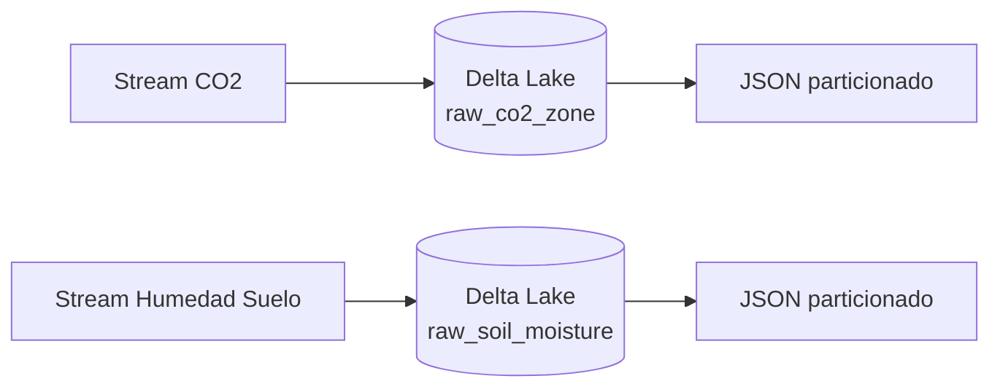

**Pista:** Seguid exactamente el patron de las lineas 83-122 de `Main.scala` (crear empty DataFrame, writeStream Delta, readStream + coalesce + writeStream).

---

### T6: Analiticas basicas sobre los datos ~3h

Extender las agregaciones que ya existen (solo `avg`) para obtener estadisticas más completas. Se pide implementar **al menos 2** de las siguientes:

| Analitica | Descripcion | Implementación |
|---|---|---|
| **Min/Max por sensor y zona** | Valores extremos en cada ventana temporal | `.agg(min(...), max(...), avg(...))` |
| **Conteo de lecturas por sensor** | Detectar sensores que dejan de enviar | `groupBy(window, sensorId).count()` |
| **Deduplicación** | Eliminar lecturas duplicadas | `dropDuplicates("sensorId", "timestamp")` |
| **Promedio CO2 y Soil por zona** | Extender el patron de temperatura a los otros sensores | `groupBy(window, zoneId).agg(avg(...))` |

Estas analiticas deben mostrarse por consola (como las ya existentes) o, si habeis hecho T5, persistirse en Delta Lake.

---

### Bonus: Elegir 1 mejora extra (opcional, para subir nota) ~3h

Elegid **una** de las siguientes mejoras:

**Opcion A - Externalizar el mapa de sensores a zonas:**
- Mover `sensorToZoneMap` de `Main.scala` a `application.conf` (formato HOCON)
- Cargarlo dinamicamente al inicio
- Test que verifique la carga

**Opcion B - Alertas por umbral:**
- Filtrar datos que superen umbrales criticos (ej: temperatura > 40, CO2 > 1000)
- Escribir las alertas en consola o Delta con una case class `Alert`
- Umbrales configurables en `application.conf`

**Opcion C - Unificar los tres streams:**
- Implementar el `//val unifiedData = ???` de `Main.scala` linea 193
- Crear una case class `UnifiedSensorData` con campos `Option` para cada tipo
- Persistir en Delta Lake

---

## 8. Resumen Visual del Trabajo Obligatorio

```mermaid
graph TD
    subgraph OBLIGATORIO - 17h estimadas
        T1[T1: Validaciones V1<br/>CO2 + Soil<br/>~3h]
        T2[T2: Validaciones V2<br/>Either + Cats<br/>~4h]
        T3[T3: Rutas hardcodeadas<br/>~1h]
        T4[T4: Zona para CO2<br/>~2h]
        T5[T5: Persistir CO2/Soil<br/>en Delta Lake<br/>~4h]
        T6[T6: Analiticas basicas<br/>min/max/count<br/>~3h]
    end

    subgraph BONUS - elegir 1 ~3h
        BA[A: Externalizar<br/>mapa zonas]
        BB[B: Alertas<br/>por umbral]
        BC[C: Unificar<br/>streams]
    end

    T1 --> T5
    T2 -.-> T5
    T3 --> T5
    T4 --> T6

    style T1 fill:#90EE90,stroke:#333
    style T2 fill:#90EE90,stroke:#333
    style T3 fill:#90EE90,stroke:#333
    style T4 fill:#90EE90,stroke:#333
    style T5 fill:#FFD700,stroke:#333
    style T6 fill:#FFD700,stroke:#333
    style BA fill:#87CEEB,stroke:#333
    style BB fill:#87CEEB,stroke:#333
    style BC fill:#87CEEB,stroke:#333
```

**Leyenda:** Verde = validaciones y limpieza de codigo | Amarillo = persistencia y analiticas | Azul = bonus opcional

---

## 9. Criterios de Evaluación

| Criterio | Peso |
|---|---|
| Codigo funcional: compila y ejecuta correctamente | 30% |
| Tests unitarios: cobertura y calidad | 20% |
| Uso correcto de patrones funcionales (Either, Option, Cats) | 20% |
| Calidad del codigo (legibilidad, nombres, estructura) | 15% |
| Documentación del trabajo realizado | 15% |
| **Bonus** (suma hasta +1 punto extra) | +10% |

---

## 10. Mejoras Futuras (referencia, NO obligatorio)

Las siguientes ideas quedan como referencia para quien quiera profundizar o para futuras iteraciones del proyecto. **No son parte de la entrega.**

### 10.1 Dead Letter Queue (DLQ)

Cuando un dato no pasa la validacion, implementar un mecanismo para no perderlo:

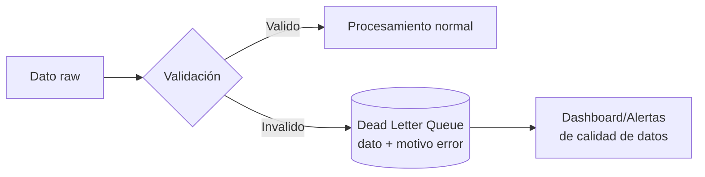

- Escribir datos invalidos en un topic Kafka separado o tabla Delta
- Incluir el dato original y el motivo del error
- Llevar metricas de datos invalidos por tipo de sensor

### 10.2 Perfiles de entorno (dev/test/prod)

- Crear perfiles de configuración en `application.conf`
- En `dev`: local[*], sin compresion, limpieza de tmp
- En `prod`: configuración de cluster, compresion habilitada
- Seleccion de perfil por parametro de la aplicación

### 10.3 Ventanas deslizantes con multiples granularidades

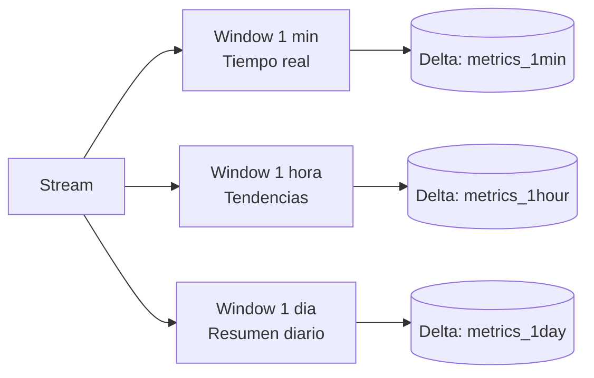

- Usar las constantes ya definidas (`OneHour`, `OneDay`, etc.)
- Sliding windows además de tumbling windows
- Persistir cada granularidad en tabla Delta separada

### 10.4 Correlación entre sensores

- Join temporal entre temperatura, CO2 y humedad del suelo por zona y ventana
- Detectar patrones (ej: "cuando la temperatura sube, el CO2 tambien")
- Calcular coeficientes de correlación en ventanas deslizantes

### 10.5 Deteccion de Anomalias con Media Movil

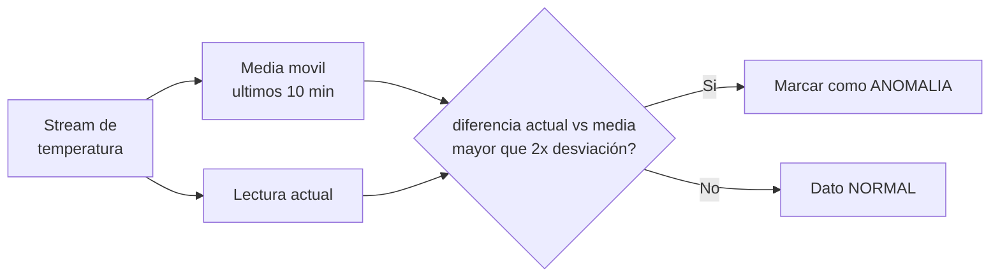

**Implementación sugerida:**
```scala
val windowSpec = Window
  .partitionBy("sensorId")
  .orderBy("timestamp")
  .rangeBetween(-600, 0) // ultimos 10 minutos en segundos

val withMovingAvg = df
  .withColumn("moving_avg", avg("temperature").over(windowSpec))
  .withColumn("moving_stddev", stddev("temperature").over(windowSpec))
  .withColumn("is_anomaly",
    abs(col("temperature") - col("moving_avg")) > col("moving_stddev") * 2
  )
```

### 10.6 Indice de Salud de la Zona

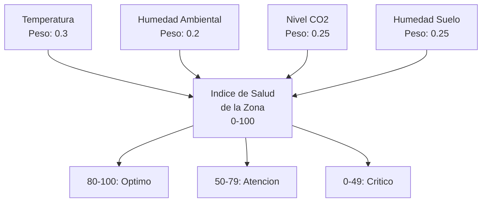

- Normalizar cada metrica a un rango 0-100 segun umbrales agronomicos
- Combinar con pesos configurables
- Calcular por ventana temporal y zona

### 10.7 Prediccion de Riego

| Condicion | Accion sugerida |
|---|---|
| Humedad suelo < 30% y tendencia descendente | Riego urgente |
| Humedad suelo 30-50% y temperatura > 35C | Riego preventivo |
| Humedad suelo > 70% | Sin necesidad de riego |

### 10.8 Dashboard de KPIs en Tiempo Real

```
KPI 1: Temperatura media por zona (ventana 5 min)
KPI 2: Tasa de datos invalidos (ventana 10 min)
KPI 3: Numero de alertas activas por zona
KPI 4: Sensores inactivos (sin datos en 2 min)
KPI 5: Indice de salud por zona
KPI 6: Prediccion de necesidad de riego
```

## 11. DesarrolloIoTAllan

### Generacion del Datavalidations (en vista de que existia en el v5 pero no en el v6)
package spark.datavalidations

import cats.data.ValidatedNel
import cats.implicits._
import domain._
import java.sql.Timestamp
import scala.util.Try

object DataValidationsV2 {
  type ValidationResult[A] = ValidatedNel[String, A]

  // Validadores genéricos
  def validateSensorId(id: String): ValidationResult[String] = 
    if (id.matches("^[a-zA-Z0-9-]+$")) id.validNel else s"ID $id inválido".invalidNel

  def validateDouble(v: String, field: String): ValidationResult[Double] =
    Try(v.toDouble).toOption.map(_.validNel).getOrElse(s"$field no es número".invalidNel)

  def validateTimestamp(ts: String): ValidationResult[Timestamp] =
    Try(Timestamp.valueOf(ts)).toOption.map(_.validNel).getOrElse(s"Fecha $ts errónea".invalidNel)

  // Implementación para CO2 y Soil (Humedad Suelo)
  def validarDatosSensorCO2(line: String): ValidationResult[CO2Data] = {
    val p = line.split(",")
    if (p.length != 3) "Faltan campos en CO2".invalidNel
    else (validateSensorId(p(0)), validateDouble(p(1), "CO2"), validateTimestamp(p(2)))
      .mapN((id, lvl, time) => CO2Data(id, lvl, time, None))
  }

  def validarDatosSensorSoil(line: String): ValidationResult[SoilMoistureData] = {
    val p = line.split(",")
    if (p.length != 3) "Faltan campos en Soil".invalidNel
    else (validateSensorId(p(0)), validateDouble(p(1), "Soil"), validateTimestamp(p(2)))
      .mapN((id, mst, time) => SoilMoistureData(id, mst, time, None))
  }
}
### Codigo del Main
import config.AppConfig
import config.AppConfig._
import domain.IoTDomain._
import org.apache.spark.sql.functions._
import org.apache.spark.sql.streaming.Trigger
import org.apache.spark.sql.{Dataset, SparkSession}
import spark.datavalidations.DataValidationsV2 // Nueva validación Cats
import spark.{ErrorLevel, SparkSessionWrapper, SparkUtils}
import utils.DataTransformations._
import utils.DirectoryCleaner

object Main extends SparkUtils with SparkSessionWrapper {
  private val isDevEnvironment = true

  // Configuración de Spark Session
  override implicit val spark: SparkSession = createSparkSession
    .withName("IoT Farm Monitoring Final")
    .withCheckpointLocation("./tmp/checkpoint")
    .withTunedShufflePartitions(10)
    .withDeltaLakeSupport
    .withLogLevel(ErrorLevel)
    .build

  def main(args: Array[String]): Unit = {
    import spark.implicits._

    // Limpieza y Rutas dinámicas
    if (isDevEnvironment) {
      DirectoryCleaner.cleanTempDirectory(rutaBase)
    }

    // Accumulator para conteo de errores
    val errorAccumulator = spark.sparkContext.longAccumulator("ErroresValidacion")

    // Broadcast join (Carga desde json)
    val zonasStaticDF = spark.read
      .option("multiLine", true)
      .json("src/main/resources/mapping_zonas.json") 
      .select(explode($"zonas").as("zona"))
      .select(
        $"zona.id".as("zoneId"),
        $"zona.nombre".as("nombreZona"),
        explode($"zona.sensores").as("sensor")
      )
      .select($"zoneId", $"nombreZona", $"sensor.id".as("sensorId"), $"sensor.tipo")

    val zonasBroadcast = broadcast(zonasStaticDF)

    // PROCESAMIENTO DE TEMPERATURA (tomando en cuenta los requerimientos adicionales especificados en las instrucciones de la plataforma)
    val temperatureHumidityDF = spark.readStream
      .format("kafka")
      .option("kafka.bootstrap.servers", "localhost:9092") // Ajusta a tu servidor
      .option("subscribe", temperatureHumidityTopic)
      .load()
      .selectExpr("CAST(value AS STRING)").as[String]
      .map { line =>
        val result = DataValidationsV2.validarDatosSensorTemperature(line) // Usando V2 (Cats)
        if (result.isInvalid) errorAccumulator.add(1)
        result.toOption
      }.flatMap(x => x).toDF()

    // Watermak y Deduplicacion
    val cleanedTempDF = temperatureHumidityDF
      .withWatermark("timestamp", "5 minutes")
      .dropDuplicates("sensorId", "timestamp")

    // Enriquecimiento (Join con zonas del json)
    val enrichedTempDF = cleanedTempDF.join(zonasBroadcast, "sensorId")

    // Persistencia en delta (usando tablas de AppConfig)
    enrichedTempDF.writeStream
      .format("delta")
      .option("checkpointLocation", getRutaParaTablaChk(Tablas.RawTemperatureHumidityZone))
      .trigger(Trigger.ProcessingTime("10 second"))
      .start(getRutaParaTabla(Tablas.RawTemperatureHumidityZone))

    // Analitica con cube
    // Temperatura promedio por sensor y zona con ventana de 1 hora
    val tempAnalyticsCube = enrichedTempDF
      .groupBy(
        window($"timestamp", "1 hour"),
        $"zoneId",
        $"sensorId"
      )
      .cube($"zoneId", $"sensorId")
      .agg(
        avg("temperature").as("avg_temp"),
        max("temperature").as("max_temp"), // T6
        count("sensorId").as("total_lecturas") // T6
      )

    // Esta seria la salida
    val query = tempAnalyticsCube.writeStream
      .outputMode("complete")
      .format("console")
      .option("truncate", "false")
      .start()

    query.awaitTermination()
  }
}